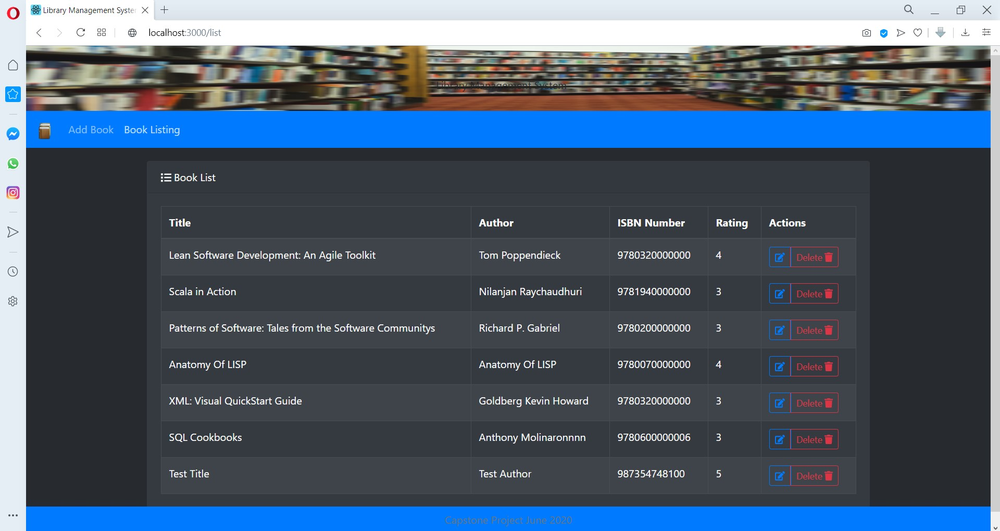
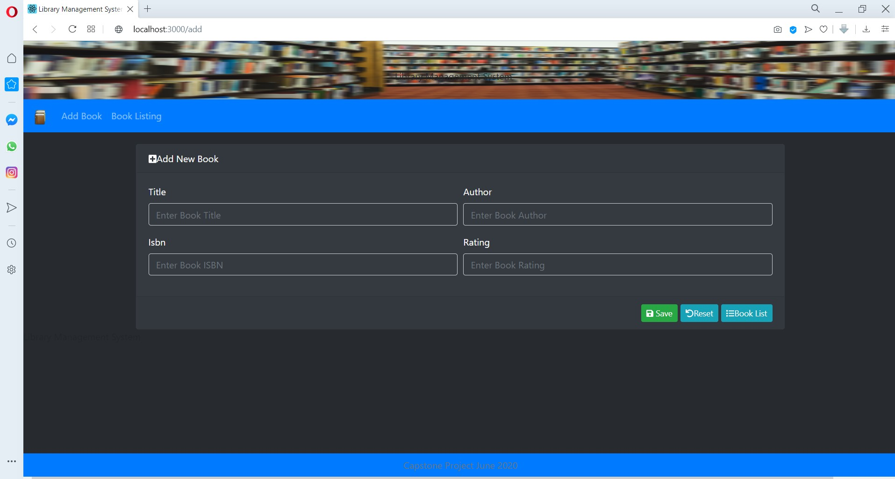
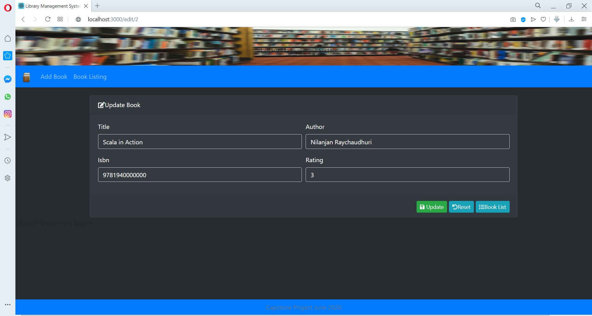

# Library Management System


A comprehensive **Library Management System** built with modern web technologies.

This project demonstrates a **full-stack architecture** with a React frontend, a Spring Boot REST API backend, and a MySQL database.

---

# 🚀 Overview

The **Library Management System** is a full-stack web application designed to manage core library operations.

The system enables librarians and administrators to manage **books and library members** through a web interface.  
The frontend communicates with a backend **Spring Boot REST API** that handles business logic and database interactions.

This project demonstrates how modern web applications integrate:

- Client-side UI
- Backend REST APIs
- Persistent relational databases

---

# 📌 Project Status

This project was created to practice **full-stack development using React and Spring Boot**.

It currently supports CRUD operations for:

- 📚 Books
- 👤 Members

The backend exposes REST endpoints which are consumed by the React frontend.

Interactive API documentation is also available through **Swagger/OpenAPI**.

---

# 📘 Key Learning Areas

• Building REST APIs using Spring Boot  
• Implementing CRUD operations with Spring Data JPA  
• Structuring a layered backend architecture (Controller → Service → Repository)  
• Connecting a React frontend to backend APIs  
• Managing relational data using MySQL  
• Documenting APIs using Swagger/OpenAPI  

---

# 🛠️ Tech Stack

## Frontend

* React

## Backend

* Java
* Spring Boot
* Spring Data JPA
* REST APIs
* Swagger / OpenAPI

## Database

* MySQL

---

# ✨ Features

## 📚 Book Management

The system provides complete CRUD functionality for managing books.

Users can:

• Add new books to the library catalog  
• View all books  
• Update book information  
• Delete books from the system  

---

## 👤 Member Management

Library members can also be managed through the API.

Users can:

• Register new members  
• View all members  
• Update member information  
• Delete members  

---

# 📡 API Documentation

The backend includes **Swagger/OpenAPI documentation**.

After starting the backend server, open:

```

[http://localhost:8080/swagger-ui.html](http://localhost:8080/swagger-ui.html)

```

or

```

[http://localhost:8080/swagger-ui/index.html](http://localhost:8080/swagger-ui/index.html)

````

Swagger allows you to:

- View all API endpoints
- Test requests directly from the browser
- Inspect request and response models

---

# 🏗️ Project Architecture

The application is organized into **three modules**:

### `libraryms-app-data`
Contains **JPA entities and persistence logic**.

### `libraryms-app-rest`
Spring Boot **REST API** exposing endpoints for books and members.

### `libraryms-app-web`
React frontend that communicates with the backend API.

---

# ⚙️ How to Run the Project

## 1️⃣ Clone the repository

```bash
git clone https://github.com/kayanr/LibraryManagementSystemApp.git
````

---

## 2️⃣ Setup MySQL

Create the database:

```sql
CREATE DATABASE libraryms_db;
```

Update database credentials in:

```
libraryms-app-rest/src/main/resources/application.properties
```

---

## 3️⃣ Start the Backend

```bash
cd libraryms-app-rest
mvn spring-boot:run
```

Backend runs at:

```
http://localhost:8080
```

---

## 4️⃣ Start the Frontend

```bash
cd libraryms-app-web
npm install
npm start
```

Frontend runs at:

```
http://localhost:3000
```

---

# 📷 Screenshots

<p align="center">
  
  
</p>

<p align="center">
  
</p>

---

# 📚 Future Improvements

Planned enhancements include:

• Implement book **loans and borrowing system**
• Add **member authentication and user roles**
• Implement **search and pagination**
• Improve frontend **UI/UX**
• Containerize the application using **Docker**
• Deploy the system to **cloud infrastructure**

---
